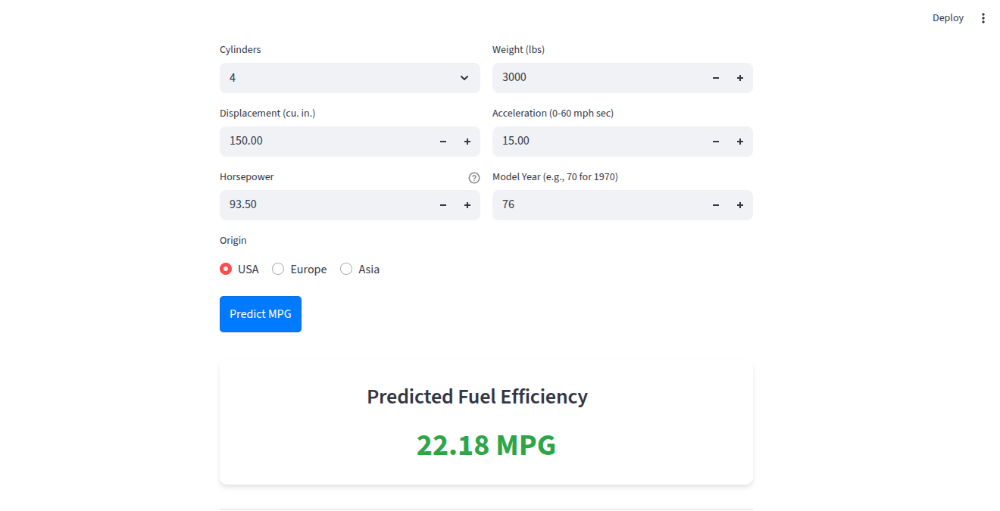

# Auto MPG Predictor

A machine learning application that predicts the fuel efficiency (Miles Per Gallon) of vehicles based on technical specifications like cylinders, displacement, horsepower, and weight.

## Features

- **Machine Learning Model**: Trained on the historic Auto MPG dataset to provide accurate predictions.
- **Interactive Web Interface**: Built with Streamlit for a smooth and responsive user experience.
- **Real-time Prediction**: Instantly calculate MPG based on user-provided vehicle details.
- **Improved Accuracy**: Includes custom feature engineering (power-to-weight ratio) for better performance.

## Streamlit Application

The application provides an intuitive interface for entering vehicle data and viewing predictions.



## Installation

1. Clone the repository:

   ```bash
   git clone <repository-url>
   cd auto-mpg-model
   ```

2. Install dependencies:

   ```bash
   pip install -r requirements.txt
   ```

3. Run the application:
   ```bash
   streamlit run app.py
   ```

## Technologies Used

- **Python**: Core programming language.
- **Scikit-Learn**: Machine learning library used for model training.
- **Streamlit**: Web framework for the interactive UI.
- **Pandas & NumPy**: Data manipulation and numerical computations.
- **Joblib**: For model serialization.
